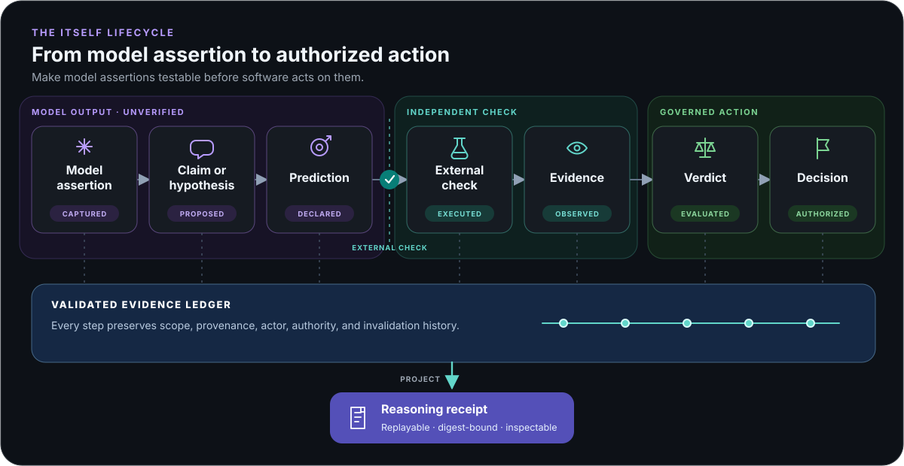

# Itself SDK

*Knowledge itself is the question.*

**Make model assertions testable before software acts on them.**

Itself is an open-source, provider-neutral assurance SDK for AI agents and
AI-driven workflows. It makes model assertions independently testable before
an application acts on them.

Use Itself when an agent reviews code, diagnoses a failed build, opens a pull or
merge request, recommends a remediation, or participates in an automated
release. The model's own confidence should not be enough for the system to
proceed.

> Itself does not make a model know when it is right. It makes model assertions
> testable, prevents the model from certifying its own assertions, and records
> how external evidence produced—or failed to produce—a decision.

AI agents can produce fluent diagnoses, recommendations, and explanations
without knowing whether they are correct
([Lee et al., 2026, Appendix A.2](https://arxiv.org/abs/2603.28052)). Most
application logs preserve the conversation, but not the epistemic structure
behind a consequential decision: what was asserted, what would falsify it,
which test ran, what evidence resulted, who judged that evidence, and why the
system acted.

Itself gives those objects an explicit, machine-readable lifecycle:

<p align="center">
  
</p>

Every record in the ledger carries explicit scope and provenance. Evidence,
verdicts, and state changes also identify the actors and authority responsible
for them.

A model may create an assertion or recommend a test. It cannot silently turn
its own output into verified evidence. Promotion to a stronger epistemic state
requires declared evidence, a matching verdict, and an authorized human,
organization, or policy-enforcing software actor.

## What problem does Itself solve?

Without an assurance boundary, AI applications commonly collapse several
different things into one blob of text:

- what a model inferred;
- what a tool actually observed;
- what an evaluator concluded;
- what a person approved;
- what the application ultimately decided to do.

That ambiguity is tolerable for casual chat. It becomes dangerous when an agent
can change code, block a release, close an incident, recommend a consequential
action, or otherwise influence real work.

Itself provides a shared protocol and reference SDK for preserving those
distinctions. It validates record structure, references, authority, scope, and
state transitions; replays the resulting evidence history deterministically;
and produces compact reasoning receipts for inspection or downstream systems.

Itself supports automated, human-reviewed, and mixed workflows. It does not
replace an agent framework, CI runner, code host, incident platform, or human
reviewer. It gives those systems a shared boundary between an assertion and an
action.

## Where does Itself fit?

### Agent-generated changes and pull or merge requests

A coding agent can assert that a patch fixes an issue and open a pull or merge
request. CI supplies test, reproduction, static-analysis, and security results.
A review policy or accountable person determines whether the change may merge.
Itself keeps the assertion provisional until the required evidence and
authority exist, then preserves the basis of the decision.

### AI code review

An AI reviewer can assert that a change introduces a vulnerability, race
condition, or regression. A tool or engineer checks the finding. The
application can show the unverified assertion, block the merge only when its
declared policy is satisfied, or record why the finding was dismissed.

### CI diagnosis and automated repair

An agent investigating a failed pipeline can record competing causes, state
what each cause predicts, and select the next diagnostic check. A CI worker or
sandbox runs that check. Its observation—not another confident explanation—
controls which causes the application may treat as supported and whether an
automated repair may proceed.

### Root-cause analysis and incident response

An operations agent can connect a failure to a deployment, dependency, or
configuration change. Telemetry queries, controlled replays, rollbacks, and
human review can test the proposed cause. Itself records what the agent
asserted, what each check found, and who authorized the mitigation or continued
investigation.

### Research and analytical workflows

A research assistant can connect claims to source artifacts, distinguish direct
observations from derived judgments, invalidate downstream conclusions when a
source changes, and preserve the human decisions that shaped a final report.

### Knowledge-worker copilots

A copilot can separate recommendations from their supporting evidence and show
which conclusions remain uncertain. Reviewers can approve, reject, or qualify
specific claims without treating the model's entire response as one indivisible
answer.

### Agent evaluation and workflow regression testing

An evaluation harness can test whether an agent declares falsifiable
predictions, chooses discriminating tests, respects evidence boundaries, and
avoids unsupported status promotion. CI can reject a workflow that is
structurally valid but violates its declared evidence or authority policy.

## How it works

1. **Capture the assertion.** Represent a model output as a scoped `claim` or
   `hypothesis` in an unverified state. Link it to the source artifact without
   requiring private chain-of-thought.
2. **State what would distinguish competing explanations.** Record the expected
   observations and check plan as protocol predictions and tests before
   execution.
3. **Run an external check.** A CI worker, sandbox, service, deterministic tool,
   or person performs the check. Its observed result becomes evidence.
4. **Evaluate under explicit authority.** A declared evaluator relates the
   evidence to the assertion and issues a verdict. A policy actor or accountable
   person authorizes any resulting state transition or application decision.
5. **Replay and inspect.** The SDK validates the complete history,
   deterministically reconstructs current epistemic state, and can generate a
   minimized reasoning receipt.

The protocol is independent of any model provider or agent framework. The SDK
includes one configurable OpenAI-compatible input adapter, but that wire format
is not the architecture and a model does not become a verifier merely because
it returns structured JSON.

## Try it locally

The repository uses Python 3.11 or later and
[`uv`](https://docs.astral.sh/uv/). From the repository root:

```bash
uv sync --locked --extra test

mkdir -p .itself/quickstart

# Verify the complete reference evidence bundle.
uv run --frozen itself bundle validate examples/cache-key-diagnosis/bundle

# Validate one protocol record.
uv run --frozen itself validate conformance/valid/proposed-claim.json

# Build and inspect a local append-only evidence ledger.
uv run --frozen itself ledger append .itself/quickstart/ledger.jsonl \
  conformance/valid/minimal-claim.json
uv run --frozen itself ledger replay .itself/quickstart/ledger.jsonl
uv run --frozen itself ledger summary .itself/quickstart/ledger.jsonl \
  --format json

# Generate a deterministic public receipt and verify it against the ledger.
uv run --frozen itself receipt generate .itself/quickstart/ledger.jsonl \
  --output .itself/quickstart/receipt.json
uv run --frozen itself receipt validate .itself/quickstart/receipt.json \
  --ledger .itself/quickstart/ledger.jsonl
```

The repository ignores `.itself/` because local inference responses and
work-in-progress evidence artifacts may contain sensitive data.

The canonical JSON Schemas are packaged for offline use and published in a
[public schema catalog](https://greaterexpanse.com/itself/schemas/). The
`itself schema export DESTINATION` command materializes the same schemas,
catalog, and checksum inventory. Validation loads the packaged copies and never
requires network access. The conformance fixtures are language-neutral. Python
is the reference implementation, not a requirement for other implementations.
An [independent JavaScript conformance check](conformance/javascript/README.md)
compiles the same schema, exercises all 27 record and bundle fixtures, and
reimplements reference resolution, authorization, and deterministic replay
without importing or executing the Python package.
The [reference bundle](examples/cache-key-diagnosis/README.md) is a closed,
digest-inventoried example containing the original input, a model assertion
artifact, the complete evidence ledger, and its deterministic reasoning
receipt.

For a compact integration walkthrough, the
[inference-to-evidence example](examples/inference_to_evidence/README.md) sends
an incident through the public generic inference boundary, captures the model
assertion, runs an external deterministic test, and materializes the resulting
evidence, verdict, authorized transition, decision, and artifacts as a verified
bundle.

## Exercise the SDK

Two reproducible, provider-free evaluation suites flex the assembled SDK beyond
unit tests. One runs a complete lifecycle and mutation campaign; the other
records an observational capacity curve at increasing ledger sizes:

```bash
mkdir -p .itself/evaluations
uv run --frozen python -m evaluations.sdk_exercise \
  --output .itself/evaluations/sdk-exercise
uv run --frozen python -m evaluations.capacity_curve \
  --output .itself/evaluations/capacity-curve
```

Each run produces a versioned JSON report, a derived Markdown report, and
independently verifiable evidence bundles. See
[the evaluation guide](docs/EVALUATIONS.md) for the checks, result semantics,
limitations, and CI artifacts.

## Create a portable evidence bundle

The SDK can materialize any closed ledger as a verified directory containing
the canonical ledger, its reasoning receipt, declared inputs, and every
referenced artifact:

```bash
mkdir -p .itself/examples

uv run --frozen itself bundle create \
  examples/cache-key-diagnosis/bundle/ledger.jsonl \
  .itself/examples/cache-key-bundle \
  --title "Cache-key diagnosis" \
  --created-at 2026-07-23T12:00:00Z \
  --artifact artifact-diagnostician-output=examples/cache-key-diagnosis/bundle/artifacts/model-assertion.json \
  --input examples/cache-key-diagnosis/bundle/inputs/diagnosis-request.json
```

The destination appears only after its inventory, ledger, receipt, and artifact
bindings pass independent validation. Verification uses explicit limits for
file count, byte size, directory traversal, and ledger records, and streams
digests without loading each artifact into memory. Final publication is an
atomic no-replace operation, so a destination created concurrently is
preserved.

See the [evidence-bundle guide](docs/EVIDENCE_BUNDLES.md) for the Python API,
CLI mapping rules, privacy boundary, and verification guarantees.

## Integrating Itself into an AI-driven workflow

An application places Itself between an agent assertion and a consequential
action:

```text
AI agent or human
    ↓ assertion and expected outcome
Itself protocol records
    ↓ declared external check
CI worker, sandbox, service, tool, or reviewer
    ↓ observed result (evidence)
evaluator, reviewer, or policy
    ↓ authorized outcome
merge, release, remediation, escalation, or other decision
    ↓
replayable ledger, application state, and reasoning receipt
```

The integration boundary can be local and lightweight: write protocol records
to a JSON Lines ledger, validate every append, and render the replayed state in
an existing application. A larger deployment can keep the same protocol while
replacing the local store, verifier adapters, and policy implementation.

Python applications can use typed constructors for every protocol record kind.
The constructors accept explicit actors, scope, authority, timestamps, and
protocol enums; return ordinary JSON objects; and validate each result against
the canonical schema before it reaches a ledger. See
[the protocol-record guide](docs/PROTOCOL_RECORDS.md) for the complete
lifecycle API and its deliberate boundaries.

## Connect a model endpoint

The installable adapter accepts any endpoint implementing the relevant
OpenAI-compatible Chat Completions fields. Provider choice is runtime
configuration—not a provider-specific class:

```python
from pathlib import Path

from itself import (
    DirectoryArtifactSink,
    EnvironmentCredential,
    OpenAICompatibleEndpoint,
    StructuredInferenceClient,
    StructuredOutputProfile,
)

endpoint = OpenAICompatibleEndpoint(
    actor_id="incident-diagnostician",
    base_url="https://inference.example.com/v1",
    model="organization/model",
    credential=EnvironmentCredential("INFERENCE_API_KEY"),
)
profile = StructuredOutputProfile(
    profile_id="diagnosis-v1",
    schema_name="diagnosis",
    system_prompt="Return only a structured causal assertion.",
    user_instruction="Diagnose the supplied incident.",
    input_label="INCIDENT",
    schema={
        "type": "object",
        "additionalProperties": False,
        "required": ["hypothesis", "next_test"],
        "properties": {
            "hypothesis": {"type": "string"},
            "next_test": {"type": "string"},
        },
    },
)
client = StructuredInferenceClient(
    endpoint=endpoint,
    artifact_sink=DirectoryArtifactSink(Path(".itself/responses")),
)
result = client.invoke({"failure": "stale report output"}, profile)
```

Bearer tokens, arbitrary API-key headers, and unauthenticated local endpoints
use the same adapter. Resource paths, query parameters, output-token field
names, accepted finish states, non-secret headers, and request extensions are
configurable. Bounded OpenAI-compatible event-stream responses are supported
for models that require streaming; their exact bytes are captured before local
assembly. Strict JSON Schema, JSON-object, and prompted-JSON capabilities are
explicit modes; every response is still strictly parsed and locally
schema-validated. Authenticated endpoints require HTTPS, and the built-in
transport does not follow redirects. There is no implicit retry, repair, or
capability fallback.

See the [inference guide](docs/INFERENCE.md) for configuration patterns,
guarantees, and the boundary for native provider protocols.

The repository also contains a transparent controlled incident investigation.
A report-generation system advances from source revision `A` to `B`, but keeps
returning stale revision `A`. An AI assistant sees the repeated failures, three
plausible root causes, and several checks it could recommend. The experiment
compares an ordinary answer to “What is causing this?” with a testable
investigation plan that states what each cause predicts and which check should
run next.

The application then runs the chosen check outside the model. Itself keeps the
answer provisional, records the resulting evidence, prevents unsupported
answers from being treated as confirmed, and leaves enough history for another
developer to reconstruct the decision.

The current live-model report shows that completed workflows crossed that
evidence boundary and that invalid model outputs stopped at an explicit
contract boundary instead of being silently repaired. It does not show that
Itself improved diagnosis accuracy: every completed attempt in this first
transparent case already named the known cause. See the
[current comparison report](experiments/results/current/2026-07-24-case-001-comparison-v5.md)
for the observations and their limits.

## Documentation

The [documentation index](docs/README.md) is the entry point for integration
guides, protocol and schema references, evidence formats, evaluations, and
controlled research. It groups the material by what a reader is trying to
accomplish rather than presenting every document as an equal starting point.
The [CI integration cookbook](cookbook/README.md) provides executable GitHub
Actions and GitLab CI recipes for gating an agent change, verifying its
evidence bundle, and publishing its reasoning receipt.

Project changes are recorded in the [changelog](CHANGELOG.md). See
[CONTRIBUTING.md](CONTRIBUTING.md) to participate and
[SECURITY.md](SECURITY.md) to report a vulnerability privately.

## Research context

Itself was inspired in part by
[*Meta-Harness: End-to-End Optimization of Model Harnesses*](https://arxiv.org/abs/2603.28052),
especially Appendix A.2. An agentic proposer repeatedly produced plausible
causal explanations for prior failures, yet its first six resulting
interventions regressed; an external evaluation loop determined what actually
worked. We saw an opportunity to generalize that boundary by making model
assertions, tests, evidence, verdicts, and decisions explicit, interoperable
records.

## What Itself does not claim

Itself can establish that records conform to a protocol, references resolve,
declared authority rules were followed, state replay is deterministic, and a
reasoning receipt matches a supplied ledger. Those are useful assurance
properties, but they do not establish that:

- a model assertion is factually correct;
- an evidence source or causal oracle is trustworthy;
- a selected test is sufficient for every real-world context;
- a human judgment is unbiased;
- private reasoning was faithful;
- one numerical score can summarize truth or trust.

Itself is a pre-1.0 SDK. Public formats carry their own versions; Python APIs may
change before `1.0.0`, with migrations documented when an earlier release is
affected.

## Development

Run the complete local quality gates with:

```bash
uv sync --locked --extra test --extra lint --extra typecheck --extra release
uv run --frozen --extra test pytest
uv run --frozen --extra lint ruff check .
uv run --frozen --extra lint ruff format --check .
uv run --frozen --extra typecheck mypy
uv run --frozen --extra typecheck pyright
uv run --frozen --extra typecheck pyright --verifytypes itself --ignoreexternal
uv run --frozen --extra release check-manifest
uv build
uv run --frozen --extra release twine check --strict dist/*
```

The distribution includes a PEP 561 `py.typed` marker. Its public annotations
are checked in strict mode by both Mypy and Pyright.

## License

Itself SDK is released under the [Mozilla Public License 2.0](LICENSE).
Copyright © Greater Expanse LLC.
